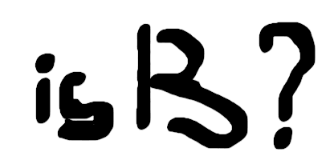

# is-thirteen

[](https://pkg.go.dev/github.com/stanleynguyen/is-thirteen)


[](https://codecov.io/gh/stanleynguyen/is-thirteen)
[](https://goreportcard.com/report/github.com/stanleynguyen/is-thirteen)

Check if a number is equal to 13. A port of [this NPM module](https://github.com/jezen/is-thirteen).

## Installation

```bash
go get -u github.com/stanleynguyen/is-thirteen
```

## Usage

```go
package main

import "github.com/stanleynguyen/is-thirteen"

func main() {
	is.Number(13).Thirteen()               // true
	is.Number(12.8).Roughly.Thirteen()     // true
	is.Number(6).Within(10).Of.Thirteen()  // true
	is.Number(2007).YearOfBirth.Thirteen() // true

	// check your math skillz
	is.Number(4).Plus(5).Thirteen()     // false
	is.Number(12).Plus(1).Thirteen()    // true
	is.Number(4).Minus(12).Thirteen()   // false
	is.Number(14).Minus(1).Thirteen()   // true
	is.Number(1).Times(8).Thirteen()    // false
	is.Number(26).Divides(2).Thirteen() // true

	// check your spelling and chemistry skillz
	is.String("tHirTeEn").Thirteen()              // true
	is.String("nethtire").AnagramOf.Thirteen()    // true
	is.String("neetriht").Backwards.Thirteen()    // true
	is.String("aLumInUm").AtomicNumber.Thirteen() // true
}

```

Check out [pkg.go.dev](https://pkg.go.dev/github.com/stanleynguyen/is-thirteen) for the full documentation.
